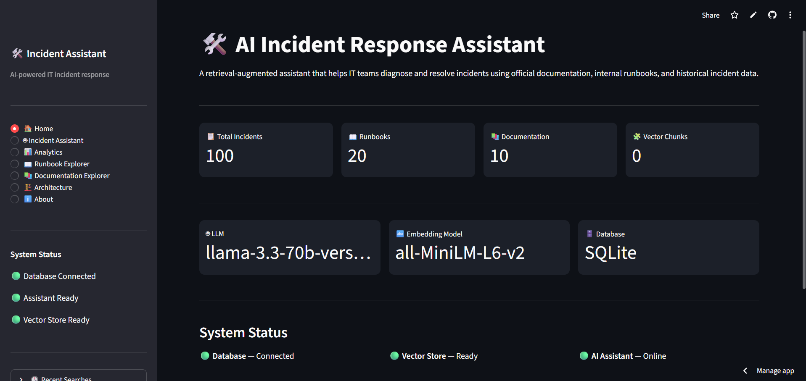
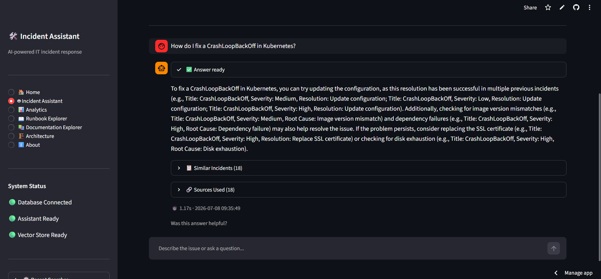
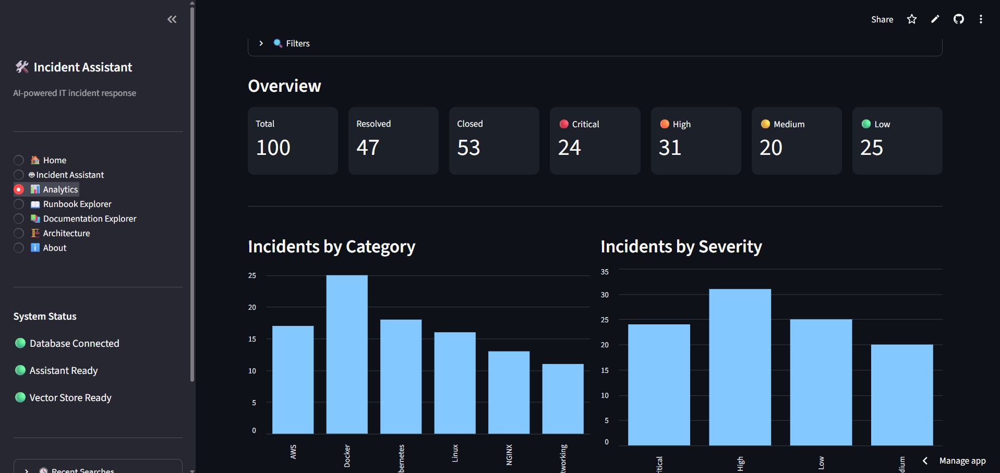
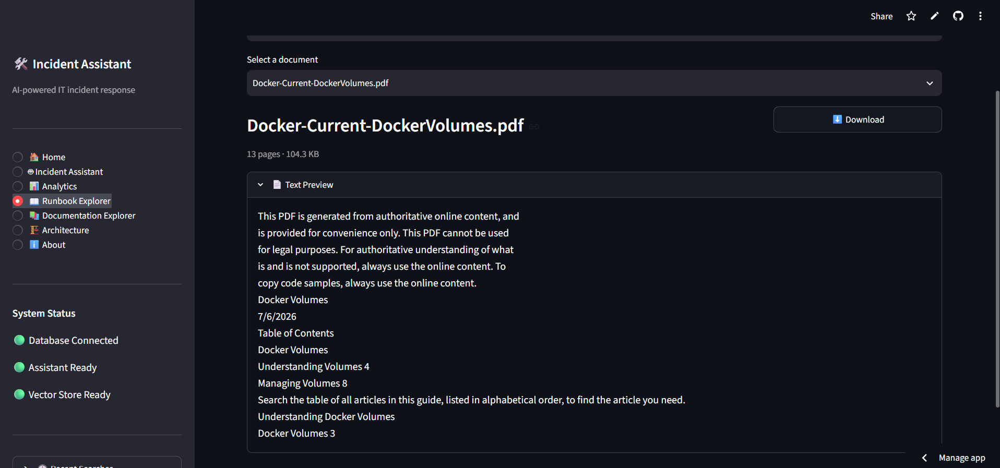
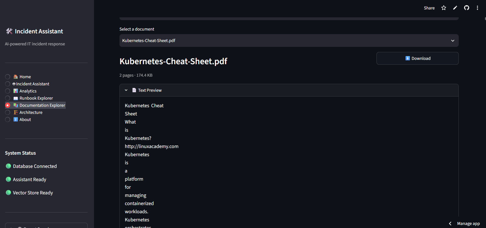
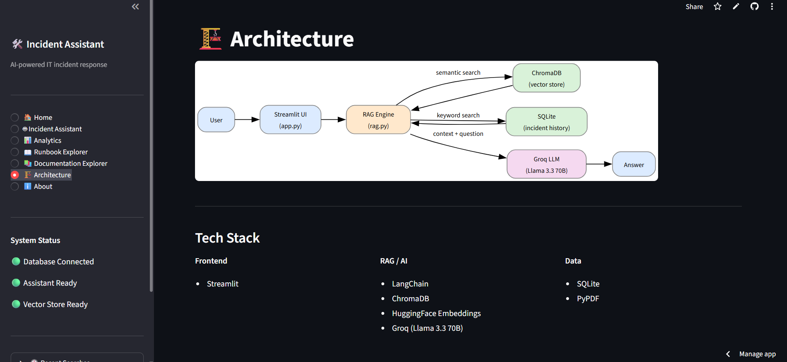
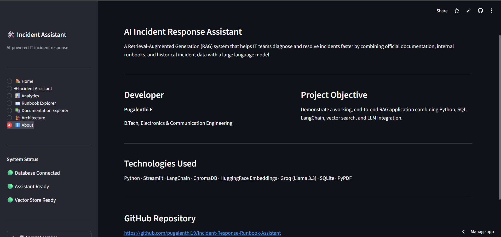

# 🚀 AI Incident Response & Runbook Assistant

An AI-powered Incident Response Assistant that helps DevOps, Cloud, and IT engineers troubleshoot incidents using **Retrieval-Augmented Generation (RAG)**, historical incident records, and official runbooks.

🌐 **Live Demo:** https://incident-response-runbook-assistant-6iugr7pd5dvva4cnupmgct.streamlit.app/

💻 **GitHub Repository:** https://github.com/pugalenthi19/Incident-Response-Runbook-Assistant

---

# 📌 Overview

This project combines:

- AI-powered incident troubleshooting
- Historical incident database (SQLite)
- Official documentation
- Technical runbooks
- Semantic Search using ChromaDB
- Large Language Model (Groq)

The assistant retrieves relevant documentation and previous incidents before generating an intelligent response.

---

# ✨ Features

- 🤖 AI Incident Assistant
- 📚 RAG-based Documentation Search
- 📖 Runbook Explorer
- 🗂 Historical Incident Search
- 📊 Analytics Dashboard
- 👍 AI Feedback System
- 📄 Source Attribution
- 📈 System Health Dashboard
- 💾 SQLite Incident Database
- ⚡ Fast Semantic Search using ChromaDB

---

# 🏗 System Architecture

```
                User Question
                      │
                      ▼
              Streamlit Interface
                      │
        ┌─────────────┴─────────────┐
        │                           │
        ▼                           ▼
   Chroma Vector DB          SQLite Database
 (Runbooks + Docs)       (Incident History)
        │                           │
        └─────────────┬─────────────┘
                      ▼
               LangChain RAG
                      │
                      ▼
              Groq Llama 3.3 70B
                      │
                      ▼
                Final AI Answer
```

---

# 🛠 Tech Stack

| Category | Technology |
|-----------|------------|
| Language | Python |
| Framework | Streamlit |
| LLM | Groq Llama 3.3 70B |
| Framework | LangChain |
| Vector Database | ChromaDB |
| Embeddings | HuggingFace MiniLM |
| Database | SQLite |
| PDF Processing | PyPDF |
| Environment | Python Dotenv |

---

# 📂 Project Structure

```
Incident-Response-Runbook-Assistant
│
├── app.py
├── rag.py
├── ingest.py
├── database.py
├── seed_database.py
├── view_database.py
├── requirements.txt
├── README.md
│
├── data
│   ├── docs
│   └── runbook
│
├── database
│   └── incidents.db
│
└── screenshots
```

---

# 📸 Application Screenshots

## 🏠 Home Dashboard



---

## 🤖 AI Incident Assistant



---

## 📊 Analytics Dashboard



---

## 📖 Runbook Explorer



---

## 📚 Documentation Explorer



---

## 🏗 Architecture



---

## ℹ About



---

# ⚙ Installation

Clone the repository

```bash
git clone https://github.com/pugalenthi19/Incident-Response-Runbook-Assistant.git
```

Go into the project

```bash
cd Incident-Response-Runbook-Assistant
```

Install dependencies

```bash
pip install -r requirements.txt
```

Create a `.env`

```
GROQ_API_KEY=your_groq_api_key
```

Build the vector database

```bash
python ingest.py
```

Run the application

```bash
streamlit run app.py
```

---

# 🎯 Example Questions

- What is CrashLoopBackOff?
- Docker container keeps restarting
- What causes a 404 error?
- EC2 SSH timeout
- DNS resolution failed
- NGINX 502 Bad Gateway
- Packet loss troubleshooting
- Memory usage exceeded
- TCP connection timeout
- IAM AccessDenied

---

# 🚀 Future Improvements

- User Authentication
- Multi-user Incident Tracking
- PDF Report Generation
- Incident Auto Classification
- REST API
- Cloud Deployment (AWS)

---

# 👨‍💻 Developer

**Pugalenthi E**

B.Tech Electronics & Communication Engineering

Skills:
- Python
- SQL
- LangChain
- RAG
- Streamlit
- ChromaDB
- HuggingFace
- Groq LLM

---

⭐ If you found this project useful, please consider giving it a star.